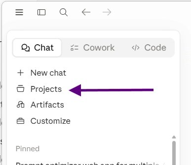

# Handoff: Summer of AI

A single-page, self-guided AI training site. It's a gift for Jane Mizzi (built by "Pooooooodle"). Tone is personal, funny, and casual. Keep that voice.

## What it is

- One static page, `index.html`, with everything inline (CSS in a `<style>` block, JS in a `<script>` block at the bottom).
- No framework, no build step, no package manager. It opens by double-clicking the file.
- Content is 12 collapsible accordion modules. Headings show by default, body is hidden until clicked.
- Aesthetic: "synthwave meets pride month." Dark background, neon rainbow accents, glowing retro sun, perspective grid, scanline overlay.

## Files (all must stay together)

```
index.html
bane.png            # Tip Top Tips
projects.png        # Projects
bones-sketch.png    # Image Generation (hand sketch)
bones-poodle.png    # Image Generation (AI version)
cowork-tab.png      # Claude Cowork
code-tab.png        # Claude Code
customize-tab.png   # Connectors / Tools
skills.png          # Skills
```

Images are referenced by bare filename, so they must sit in the same folder as `index.html` (repo root). If they move, the `src` paths break.

## Sections, in order

1. Tip Top Tips
2. Claude Desktop App
3. Context Portfolio
4. Projects
5. Image Generation
6. Setting up an AI thought partner / assistant / expert / tutor / friend of a friend
7. Claude Cowork
8. Claude Code
9. Connectors / Tools
10. Skills
11. /goal
12. AgentOS (maybe?)

## How a section is built

Each is a `<section class="acc" style="--i:N">` containing a header button and a hidden body:

```html
<section class="acc" style="--i:4">
  <button class="acc-header" aria-expanded="false">
    <span class="num">04</span>
    <span class="acc-title">Projects</span>
    <span class="chev" aria-hidden="true"></span>
  </button>
  <div class="acc-body"><div class="acc-inner">
    <p>...text...</p>
    <a class="link-btn" href="..." target="_blank" rel="noopener">Label &rarr;</a>
    
  </div></div>
</section>
```

Order inside `.acc-inner` is always: text, then link (if any), then image (if any).

## Conventions to follow

- Numbering: the `<span class="num">NN</span>` badge and the `style="--i:N"` value must match the section's position. `--i` drives the staggered load animation. If you add, remove, or reorder sections, renumber both for every section in document order (01..N, and --i 1..N).
- Images: cap each with an inline `style="max-width:Xpx"` set to the image's native width so it never upscales and blurs. Current caps: tab screenshots ~390px, skills 562px, the bones pair 520px each, bane 460px. Always include real `alt` text.
- There is a comment block near the top of `<main>` explaining how to add a picture. Keep it current.
- Writing style (Mike's rules): never use em dashes, ever. Use contractions. Keep his jokes and wording verbatim unless he asks otherwise. Do not "clean up" his voice.

## Open TODOs

- Tip Top Tips has two overlapping bullets about having the AI ask you questions. Mike chose to keep both for now.
- Hero title is "Summer of AI" (placeholder). Subtitle reads: "A self-guided field guide, built just for you, Jane Mizzi. Work through it whenever. Love me forever." Edit points are marked with an `EDIT:` comment.
- Possible future feature: enforce module order (lock later modules until earlier ones are opened, or add per-module progress checkmarks). Not built.

## Design tokens (CSS variables in `:root`)

- Background: `--bg #0a0118`, `--bg2 #160630`. Text: `--ink #f5ecff`, muted `--muted #b89ad9`.
- Rainbow spectrum: `--c1 #ff2e7e`, `--c2 #ff7a2f`, `--c3 #ffd23f`, `--c4 #39ff9e`, `--c5 #22d3ff`, `--c6 #6a5cff`, `--c7 #c44dff`.
- `--rainbow` and `--rainbow-soft` gradients are used for the title, section titles, and the footer heart.
- Fonts (Google Fonts): Monoton (hero title), Orbitron (section titles, number badges), Rajdhani (body).

## Local preview

Open `index.html` in a browser. No server needed. (If you want a local server anyway: `python3 -m http.server` from the folder, then visit the printed URL.)

## Deploy (GitHub + Vercel)

- All files live at the repo root, `index.html` included.
- In Vercel, import the repo, Framework Preset "Other," no build command, no output directory. It serves the static files as-is.
- `index.html` is treated as the homepage automatically.
- Pushing to the repo's main branch triggers an automatic redeploy.

## Footer

The footer must keep the exact text: "Created with love by Pooooooodle". Do not change the spelling.
